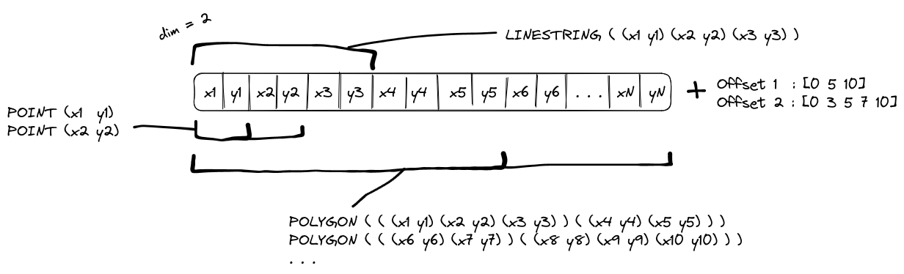

# High-Performance Simple Features (hpsf)

This library implements a geometry data model based on offset-based one-dimensional arrays (like [geoarrow](https://github.com/geoarrow/geoarrow), or [flatbuffers](https://flatbuffers.dev/)), with an [OGC Simple Features Access](https://www.ogc.org/standard/sfa/) compliant interface.

